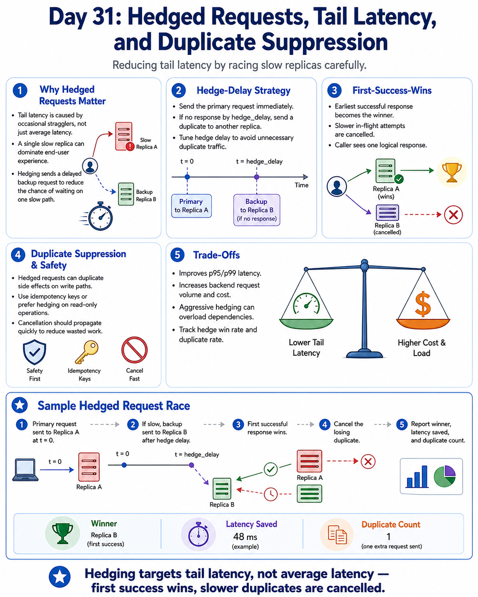

# Day 31: Hedged Requests, Tail Latency, and Duplicate Suppression

Day 31 focuses on reducing tail latency by sending backup requests when the primary call is slow.

It covers:
- hedged request fundamentals
- hedge-delay tuning
- first-success-wins behavior
- cancellation of losing duplicates
- tail-latency improvement trade-offs
- capacity and cost implications

In short, Day 31 is about improving p95/p99 latency by racing replicas carefully instead of waiting on one slow response path.



[Day 31 PDF](./System_Design_Day_31.pdf)

## Core ideas

### Why hedged requests matter
- Tail latency is often caused by occasional stragglers rather than average latency.
- A single slow replica can dominate end-user experience.
- Hedging sends a delayed backup to reduce the chance of waiting for a straggler.

### Hedge-delay strategy
- Send the primary request immediately.
- If response is not back by `hedge_delay`, send a duplicate to another replica.
- Keep hedge delay large enough to avoid unnecessary duplicate traffic.

### First-success-wins model
- The earliest successful response becomes the winner.
- Remaining in-flight attempts are cancelled.
- Caller sees one logical response even though multiple attempts may have been issued.

### Duplicate suppression and safety
- Hedged requests can trigger duplicate side effects on write paths.
- Use idempotency keys or limit hedging to read-only operations.
- Cancellation should propagate quickly to reduce wasted work.

### Trade-offs
- Hedging improves tail latency but increases backend request volume.
- Aggressive hedging can overload dependencies and increase cost.
- Rollout should be controlled with metrics on duplicate rate and win rate.

## Day-31 sample: Hedged Request Race Simulator

This repository includes a small hedged-request simulator in both Python and Java.

### Functional requirements
- Start primary request immediately
- Launch backup replicas after fixed hedge delay
- Choose first successful attempt as winner
- Cancel slower in-flight attempts
- Report duplicate count, winner, and latency savings vs primary-only

### High-level components
- `ReplicaEndpoint`: endpoint latency and success behavior
- `AttemptRecord`: attempt start/finish metadata
- `HedgedRequestExecutor`: hedging orchestration and winner selection
- `ExecutionResult`: status, winner, completion time, and timeline

### Data flow
1. Build attempt schedule (`primary` at `t=0`, backups staggered by hedge delay)
2. Track attempt finish times and find first successful completion
3. Mark winner and cancel slower in-flight attempts
4. Compute duplicate count and tail-latency savings
5. Return result timeline for debugging and interview explanation

## Project structure

```text
Day-31/
  README.md
  hedged-request-sample/
    python/
      hedged_request.py
      demo.py
    java/
      HedgedRequestSystem.java
      Main.java
```

## Run the sample

### Python

```powershell
cd hedged-request-sample\python
python demo.py
```

### Java

```powershell
cd hedged-request-sample\java
javac Main.java HedgedRequestSystem.java
java Main
```

## Interview takeaways
- Hedging targets tail latency, not average latency
- First-success-wins plus cancellation controls wasted work
- Hedge delay should be based on real latency percentiles
- Idempotency protection is mandatory for side-effecting paths
- Duplicate ratio and hedge win rate are key operational metrics

## Next improvements
- Use percentile-driven adaptive hedge delay
- Cap max duplicate attempts by request class
- Add per-endpoint health scoring for hedge target selection
- Add request cost model for hedge policy optimization
- Add timeout budget integration with end-to-end deadlines
