# System Design Preparation

This repository tracks day-wise system design preparation notes and sample projects.

## Contents

- [Day-1](./Day-1/README.md): Introduction to system design and a URL shortener sample in Python and Java.
- [Day-2](./Day-2/README.md): Networking, scalability, and delivery fundamentals with a round-robin load balancer sample.
- [Day-3](./Day-3/README.md): Databases, consistency, and partitioning fundamentals with a consistent hashing sample.
- [Day-4](./Day-4/README.md): Architecture, messaging, and API communication fundamentals with a publish-subscribe event bus sample.
- [Day-5](./Day-5/README.md): Reliability, security, and platform operations fundamentals with a token bucket rate limiter sample.
- [Day-6](./Day-6/README.md): Coordination, idempotency, and distributed workflow fundamentals with an idempotent request processor sample.
- [Day-7](./Day-7/README.md): Observability, monitoring, and tracing fundamentals with a trace context propagator sample.
- [Day-8](./Day-8/README.md): Search, indexing, and information retrieval fundamentals with an inverted index search sample.
- [Day-9](./Day-9/README.md): Caching, eviction, and data access performance fundamentals with an LRU cache sample.
- [Day-10](./Day-10/README.md): Queues, retries, and dead-letter handling fundamentals with a retry queue sample.
- [Day-11](./Day-11/README.md): Streams, partitioned logs, and consumer-group offset management fundamentals with a partitioned log sample.
- [Day-12](./Day-12/README.md): Probabilistic data structures and Bloom filter fundamentals with a Bloom filter sample.
- [Day-13](./Day-13/README.md): Merkle tree, data integrity, and anti-entropy fundamentals with a Merkle tree sample.
- [Day-14](./Day-14/README.md): Quorum replication, tunable consistency, and read-repair fundamentals with a quorum key-value sample.
- [Day-15](./Day-15/README.md): Raft consensus, leader election, and log replication fundamentals with a simplified Raft sample.
- [Day-16](./Day-16/README.md): Two-phase commit, distributed transactions, and recovery fundamentals with a 2PC coordinator sample.
- [Day-17](./Day-17/README.md): SOLID principles and maintainable service design fundamentals with a SOLID alert routing sample.
- [Day-18](./Day-18/README.md): Saga pattern, compensating transactions, and orchestration fundamentals with an order saga sample.
- [Day-19](./Day-19/README.md): Transactional outbox, dual-write safety, and reliable event delivery fundamentals with an outbox relay sample.
- [Day-20](./Day-20/README.md): CQRS, read-model projections, and eventual consistency fundamentals with a CQRS order projection sample.
- [Day-21](./Day-21/README.md): Event sourcing, snapshotting, and aggregate rebuild fundamentals with an event-sourced account ledger sample.
- [Day-22](./Day-22/README.md): Event versioning, schema evolution, and upcasting fundamentals with an event upcasting ledger sample.
- [Day-23](./Day-23/README.md): Schema registry, compatibility checks, and contract safety fundamentals with a schema registry simulator sample.
- [Day-24](./Day-24/README.md): Idempotent consumer, deduplication, and delivery guarantee fundamentals with an idempotent payment consumer sample.
- [Day-25](./Day-25/README.md): Inbox pattern, exactly-once effect, and consumer reliability fundamentals with a durable inbox payment consumer sample.
- [Day-26](./Day-26/README.md): Retry backoff, dead letter queue, and poison message handling fundamentals with a retry + DLQ simulator sample.
- [Day-27](./Day-27/README.md): Backpressure, flow control, and load shedding fundamentals with a backpressure admission controller sample.
- [Day-28](./Day-28/README.md): Bulkhead isolation, worker pools, and blast radius control fundamentals with a bulkhead worker pool simulator sample.
- [Day-29](./Day-29/README.md): Circuit breaker, failure thresholds, and recovery probing fundamentals with a dependency guard sample.
- [Day-30](./Day-30/README.md): Timeouts, deadlines, and cancellation propagation fundamentals with a deadline guarded request chain sample.

## Goal 

Build strong fundamentals in:
- requirement analysis
- high-level and low-level design
- scalability and reliability
- data modeling and trade-offs

## Day 1

Introduction to system design and why architecture decisions matter early.

- Topic: what system design is
- Focus: requirements, architecture, interfaces, and data design
- Sample project: URL shortener in Python and Java

[Read Day-1 notes](./Day-1/README.md)

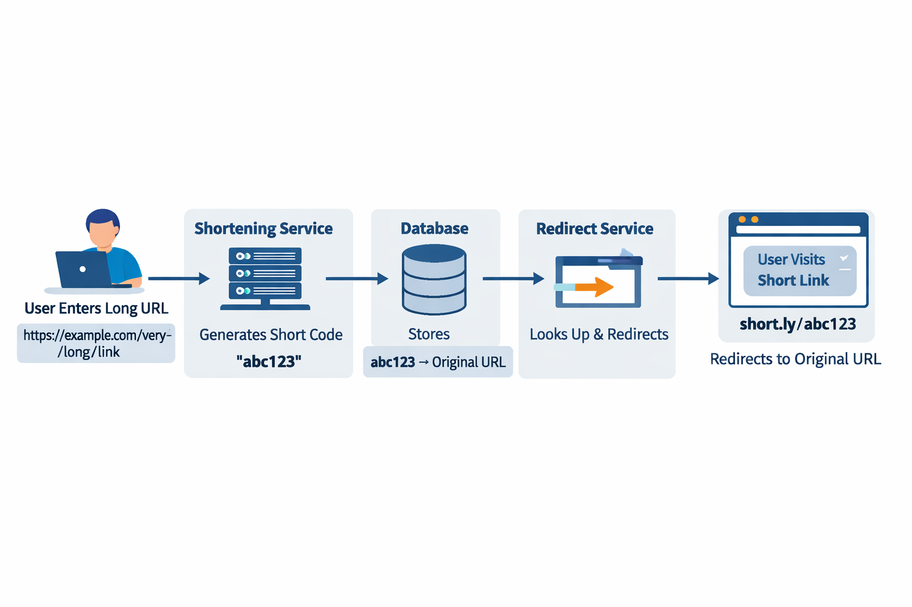

## Day 2

Networking, traffic flow, scalability, and delivery fundamentals for distributed systems.

- Topics: IP, OSI, TCP/UDP, DNS, load balancing, clustering, caching, CDN, proxy
- Focus: how requests move through systems and how to keep them available and fast
- Sample project: round-robin load balancer in Python and Java

[Read Day-2 notes](./Day-2/README.md)

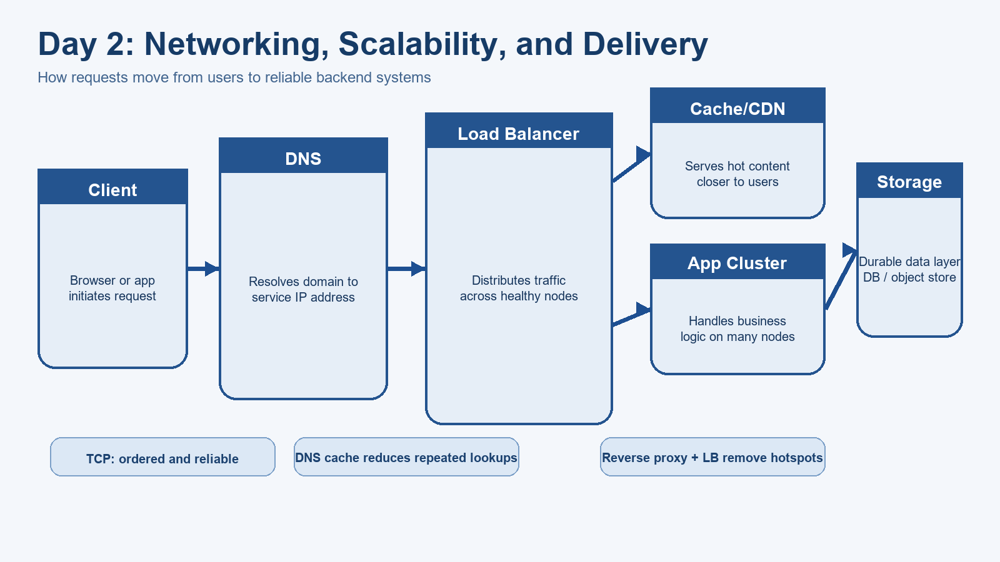

## Day 3

Databases, consistency, partitioning, and distributed data fundamentals.

- Topics: SQL vs NoSQL, replication, indexes, normalization, ACID/BASE, CAP, sharding, consistent hashing
- Focus: how large systems store and distribute data safely at scale
- Sample project: consistent hashing shard router in Python and Java

[Read Day-3 notes](./Day-3/README.md)

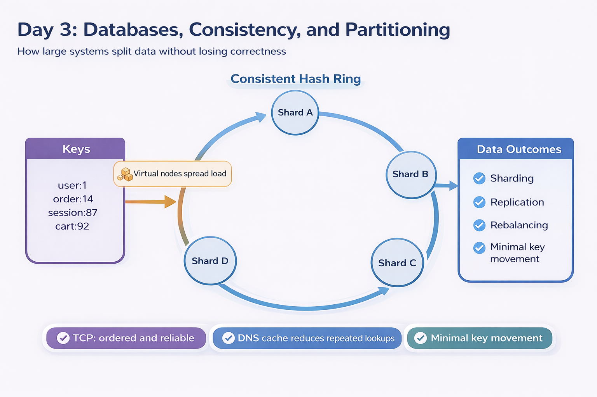

## Day 4

Architectural patterns, asynchronous communication, API choices, and real-time delivery models.

- Topics: N-tier architecture, queues, pub/sub, ESB, monoliths vs microservices, EDA, CQRS, API Gateway, REST/GraphQL/gRPC, WebSockets
- Focus: how services are structured and how they communicate without tight coupling
- Sample project: publish-subscribe event bus in Python and Java

[Read Day-4 notes](./Day-4/README.md)

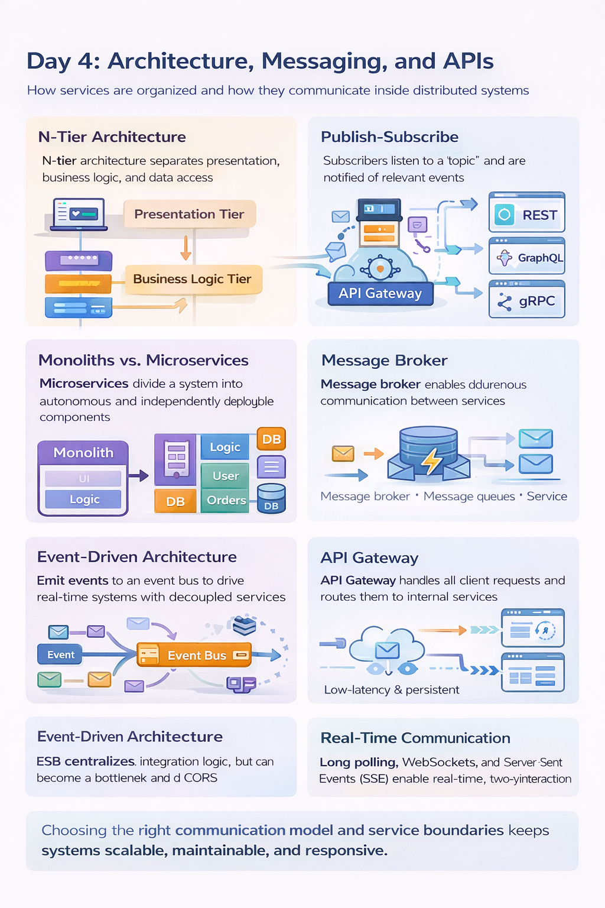

## Day 5

Reliability, security, service discovery, and platform operations fundamentals for production distributed systems.

- Topics: geohashing, quadtrees, circuit breaker, rate limiting, service discovery, SLA/SLO/SLI, disaster recovery, VMs, containers, OAuth, OIDC, SSO, TLS
- Focus: how to keep systems resilient, discoverable, and secure after deployment
- Sample project: token bucket rate limiter in Python and Java

[Read Day-5 notes](./Day-5/README.md)

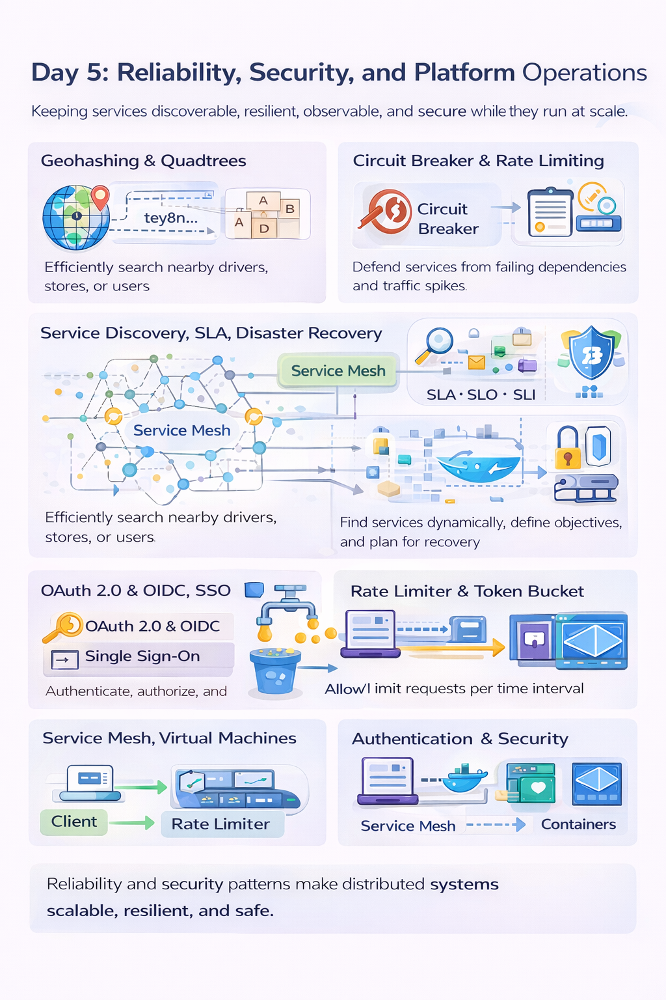

## Day 6

Coordination, retries, and workflow correctness fundamentals for distributed systems.

- Topics: timeouts, retries, exponential backoff, jitter, idempotency, delivery guarantees, distributed locks, leader election, sagas, outbox/inbox, orchestration vs choreography
- Focus: how to keep business operations correct when requests are duplicated or workflows fail midway
- Sample project: idempotent request processor in Python and Java

[Read Day-6 notes](./Day-6/README.md)

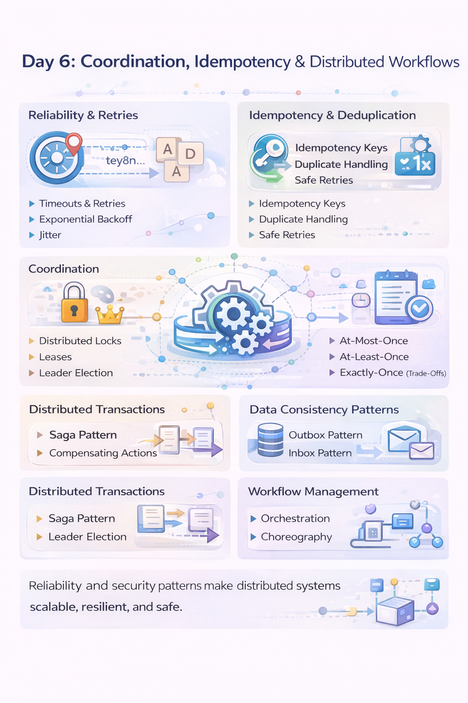

## Day 7

Observability, tracing, and production debugging fundamentals for distributed systems.

- Topics: logs, metrics, traces, structured logging, correlation IDs, RED/USE metrics, dashboards, alerting, distributed tracing, sampling, telemetry cost
- Focus: how to detect problems quickly and reconstruct request behavior across services
- Sample project: trace context propagator in Python and Java

[Read Day-7 notes](./Day-7/README.md)

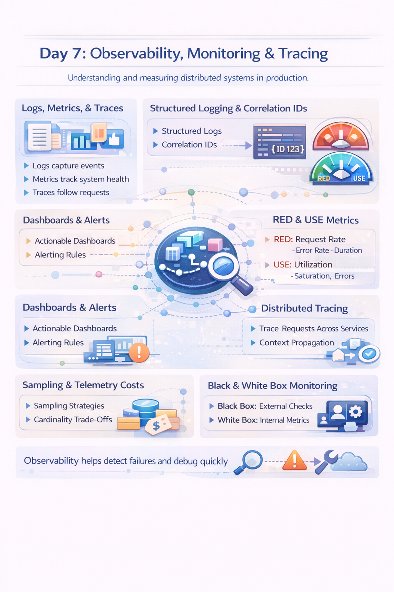

## Day 8

Search, indexing, and information retrieval fundamentals for distributed systems.

- Topics: search basics, inverted indexes, tokenization, ranking, autocomplete, indexing pipelines, sharding, replication, query fan-out
- Focus: how to organize large content collections so users can retrieve relevant results quickly
- Sample project: inverted index search in Python and Java

[Read Day-8 notes](./Day-8/README.md)

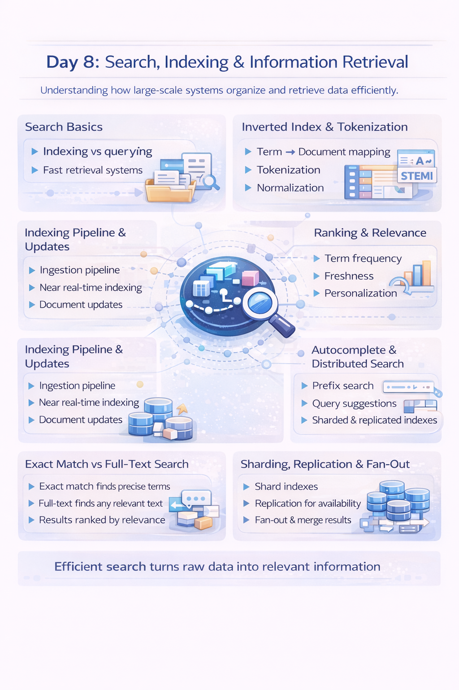

## Day 9

Caching, eviction, and data access performance fundamentals for distributed systems.

- Topics: cache patterns, TTL, invalidation, eviction policies, local vs distributed cache, hot keys, stampedes, consistency
- Focus: how to reduce read latency and backend load without losing freshness control
- Sample project: LRU cache in Python and Java

[Read Day-9 notes](./Day-9/README.md)

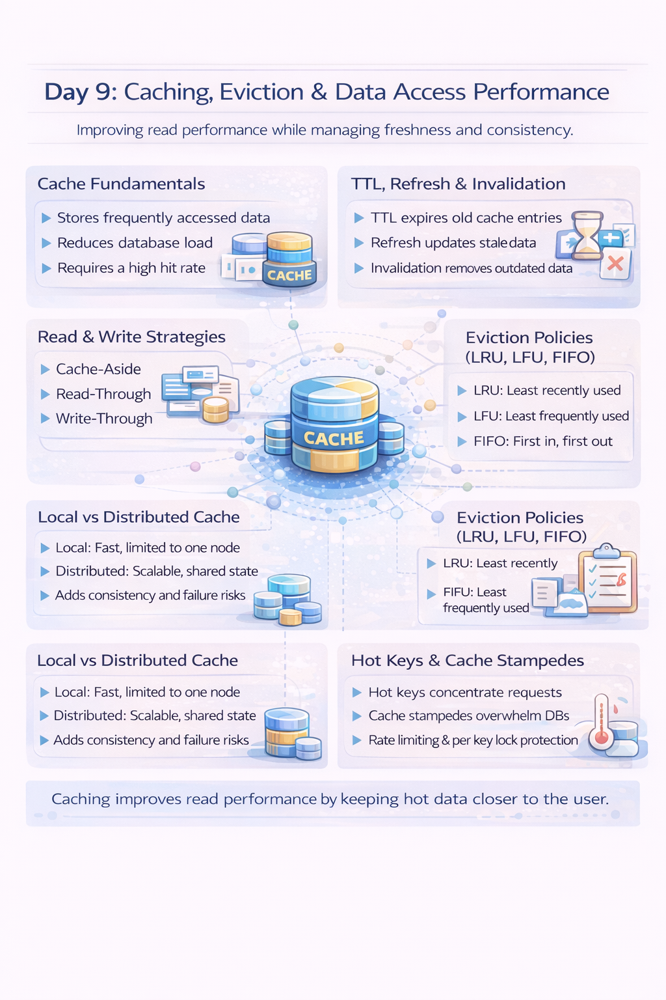

## Day 10

Queues, retries, and dead-letter handling fundamentals for asynchronous processing workflows.

- Topics: asynchronous queues, at-least-once delivery, idempotency, retries, dead-letter queues, backpressure
- Focus: how to keep background processing reliable when workers fail or downstream systems are slow
- Sample project: retry queue with dead-letter handling in Python and Java

[Read Day-10 notes](./Day-10/README.md)

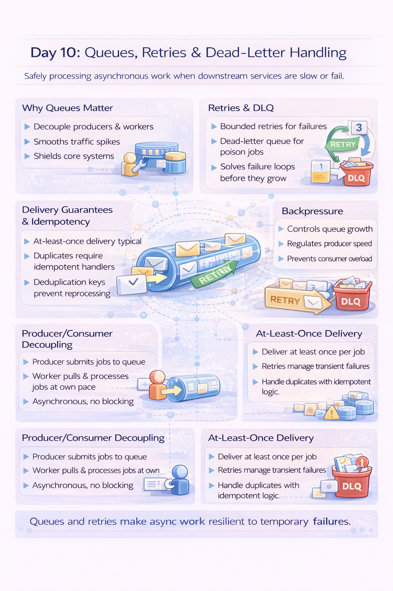

## Day 11

Streams, partitioned logs, and consumer-group offset management fundamentals for event-driven systems.

- Topics: append-only logs, partitioning, ordering guarantees, consumer groups, offsets, replay, retention, lag
- Focus: how to decouple producers and consumers while preserving scalable throughput and recoverable consumption
- Sample project: partitioned log with consumer groups and explicit offset commits in Python and Java

[Read Day-11 notes](./Day-11/README.md)

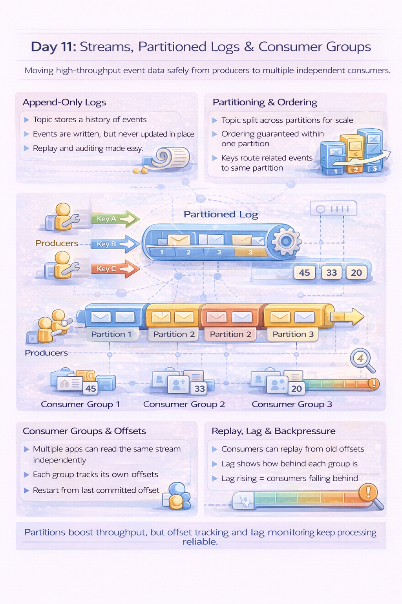

## Day 12

Probabilistic data structures and memory-efficient membership testing fundamentals for large-scale systems.

- Topics: Bloom filters, false positives, approximate membership, memory vs accuracy trade-offs, cache penetration protection, sketch-based thinking
- Focus: how to answer membership-style questions cheaply before falling back to an exact system of record
- Sample project: Bloom filter in Python and Java

[Read Day-12 notes](./Day-12/README.md)

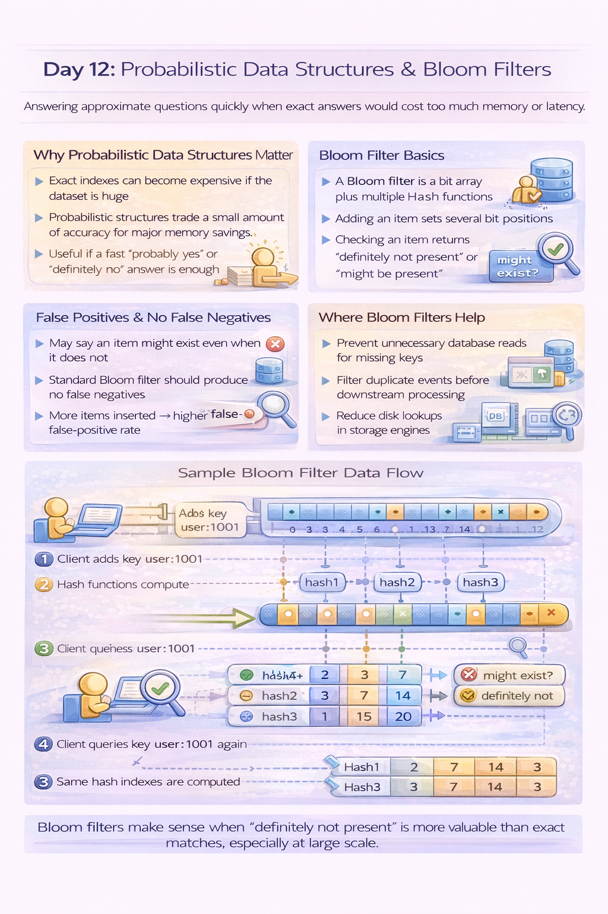

## Day 13

Merkle trees, data integrity, and anti-entropy fundamentals for distributed storage and synchronization.

- Topics: Merkle trees, root hashes, inclusion proofs, replica comparison, anti-entropy, hashing trade-offs
- Focus: how to compare and verify large datasets efficiently without transferring every record
- Sample project: Merkle tree in Python and Java

[Read Day-13 notes](./Day-13/README.md)

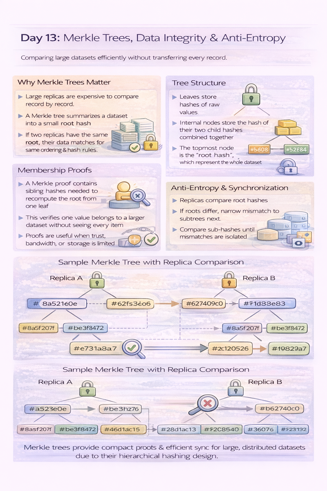

## Day 14

Quorum replication, tunable consistency, and read-repair fundamentals for replicated databases.

- Topics: quorum math (`N`, `R`, `W`), tunable consistency, stale reads, read repair, replication trade-offs
- Focus: how to balance consistency, latency, and availability when replicas diverge
- Sample project: quorum key-value store with read repair in Python and Java

[Read Day-14 notes](./Day-14/README.md)

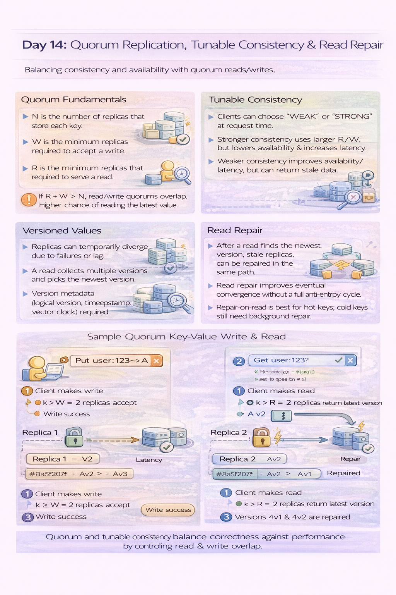

## Day 15

Raft consensus, leader election, and replicated log fundamentals for distributed coordination.

- Topics: Raft roles and terms, majority voting, leader election, log replication, commit rules, safety trade-offs
- Focus: how a cluster agrees on one ordered history of updates even when some nodes fail
- Sample project: simplified Raft consensus simulation in Python and Java

[Read Day-15 notes](./Day-15/README.md)

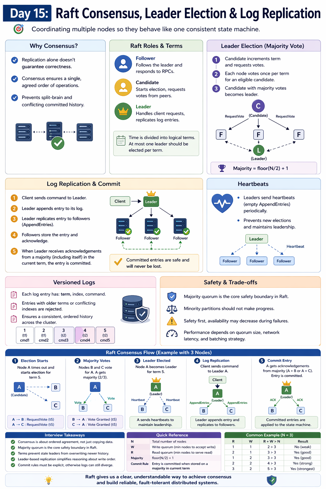

## Day 16

Two-phase commit, distributed transactions, and failure-recovery fundamentals for multi-service consistency.

- Topics: transaction coordinator/participant roles, prepare/commit phases, decision logs, uncertain states, reconciliation
- Focus: how to keep cross-service operations atomic when one business action spans multiple systems
- Sample project: two-phase commit coordinator simulation in Python and Java

[Read Day-16 notes](./Day-16/README.md)

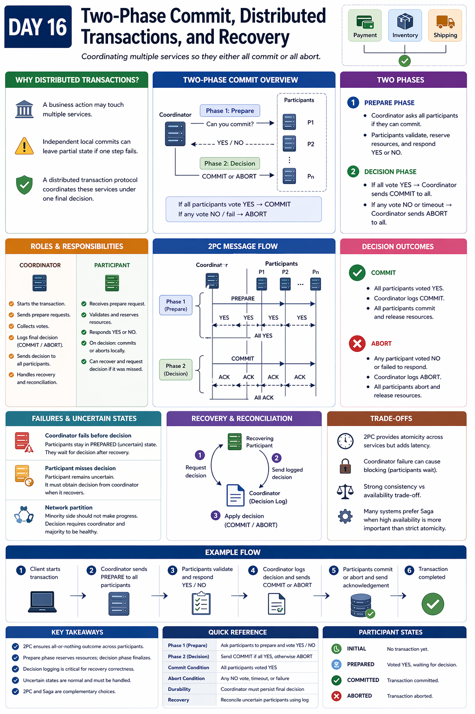

## Day 17

SOLID principles and maintainable service design fundamentals for extensible, testable software architecture.

- Topics: SRP, OCP, LSP, ISP, DIP, interface design, dependency management
- Focus: how to design modules and services that are easier to extend safely with low coupling
- Sample project: SOLID alert routing service in Python and Java

[Read Day-17 notes](./Day-17/README.md)

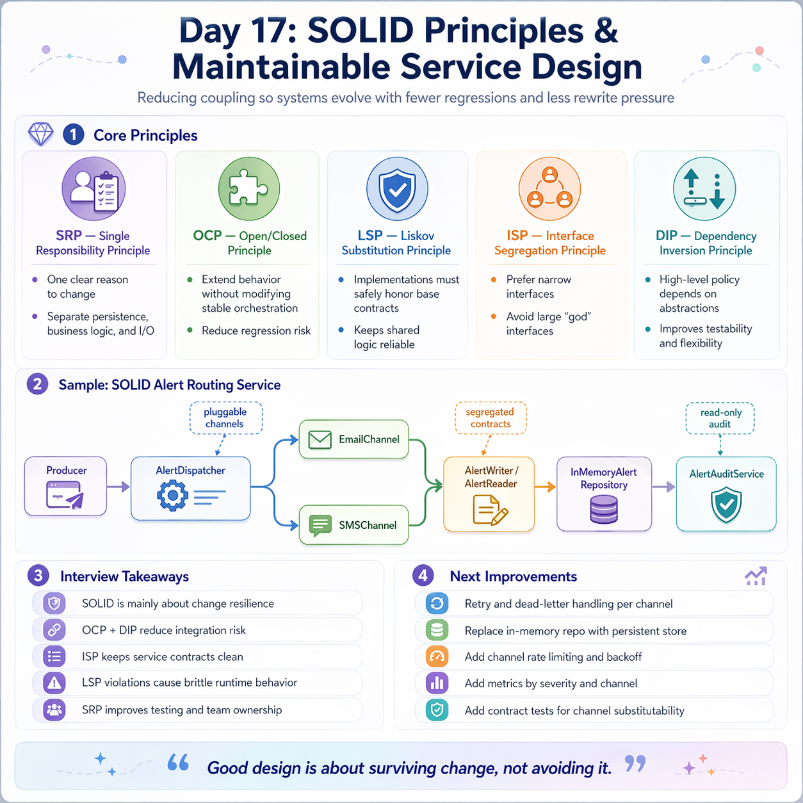

[Day-17 PDF](./Day-17/System_Design_Day_17.pdf)

## Day 18

Saga pattern, compensating transactions, and orchestration fundamentals for distributed workflows.

- Topics: local transactions, orchestration, compensation logic, rollback sequencing, eventual consistency
- Focus: how to keep multi-service business flows correct without strict global transactions
- Sample project: order saga orchestrator in Python and Java

[Read Day-18 notes](./Day-18/README.md)

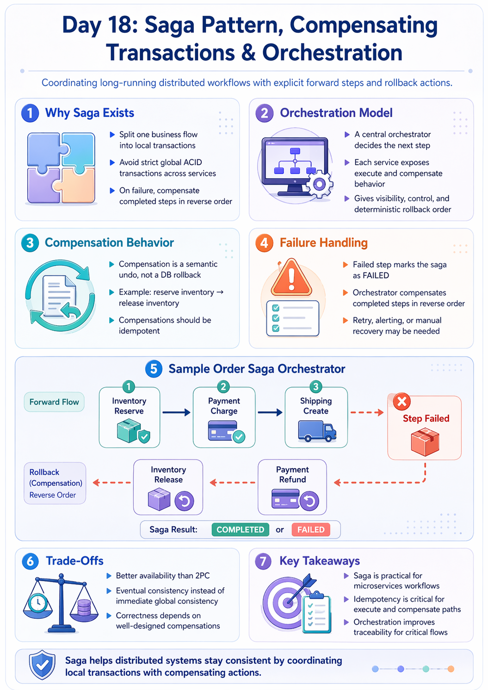

[Day-18 PDF](./Day-18/System_Design_Day_18.pdf)

## Day 19

Transactional outbox, dual-write safety, and reliable event delivery fundamentals for event-driven systems.

- Topics: dual-write failure modes, transactional outbox, relay polling, at-least-once delivery, idempotent consumers
- Focus: how to store business state and event intent atomically, then publish reliably with retries
- Sample project: transactional outbox simulation in Python and Java

[Read Day-19 notes](./Day-19/README.md)

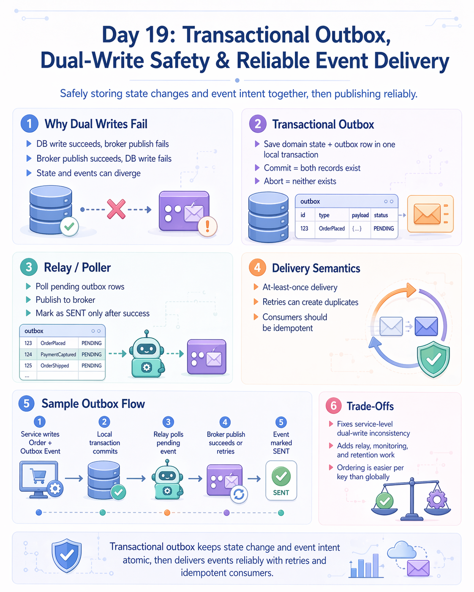

[Day-19 PDF](./Day-19/System_Design_Day_19.pdf)

## Day 20

CQRS, read-model projections, and eventual consistency fundamentals for scalable event-driven systems.

- Topics: command/query separation, write model vs read model, event projection, lag handling, replay
- Focus: how to optimize command and query paths independently while preserving correctness
- Sample project: CQRS order projection simulation in Python and Java

[Read Day-20 notes](./Day-20/README.md)

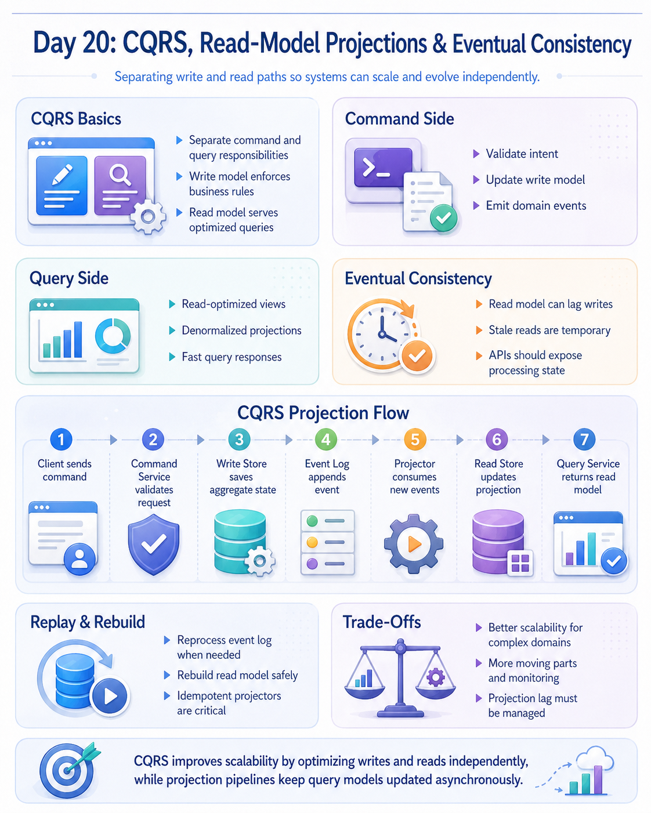

[Day-20 PDF](./Day-20/System_Design_Day_20.pdf)

## Day 21

Event sourcing, snapshotting, and aggregate rebuild fundamentals for audit-friendly event-driven systems.

- Topics: append-only event store, optimistic concurrency, replay, snapshotting, event contracts
- Focus: how to make domain events the source of truth and reconstruct state reliably
- Sample project: event-sourced account ledger simulation in Python and Java

[Read Day-21 notes](./Day-21/README.md)

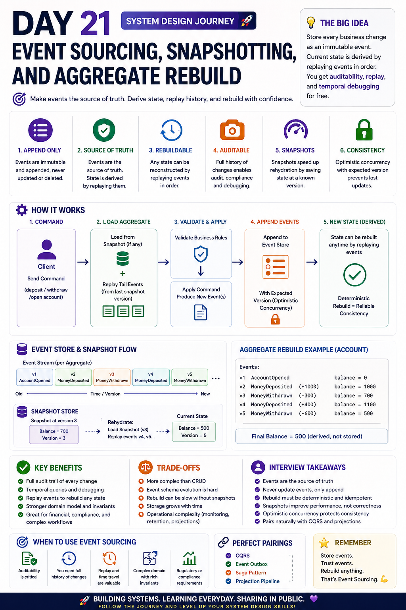

[Day-21 PDF](./Day-21/System_Design_Day_21.pdf)

## Day 22

Event versioning, schema evolution, and upcasting fundamentals for long-lived event-driven systems.

- Topics: event contract versioning, backward compatibility, upcaster chains, replay safety, schema evolution trade-offs
- Focus: how to keep historical and current events consumable together without rewriting immutable history
- Sample project: event upcasting ledger in Python and Java

[Read Day-22 notes](./Day-22/README.md)

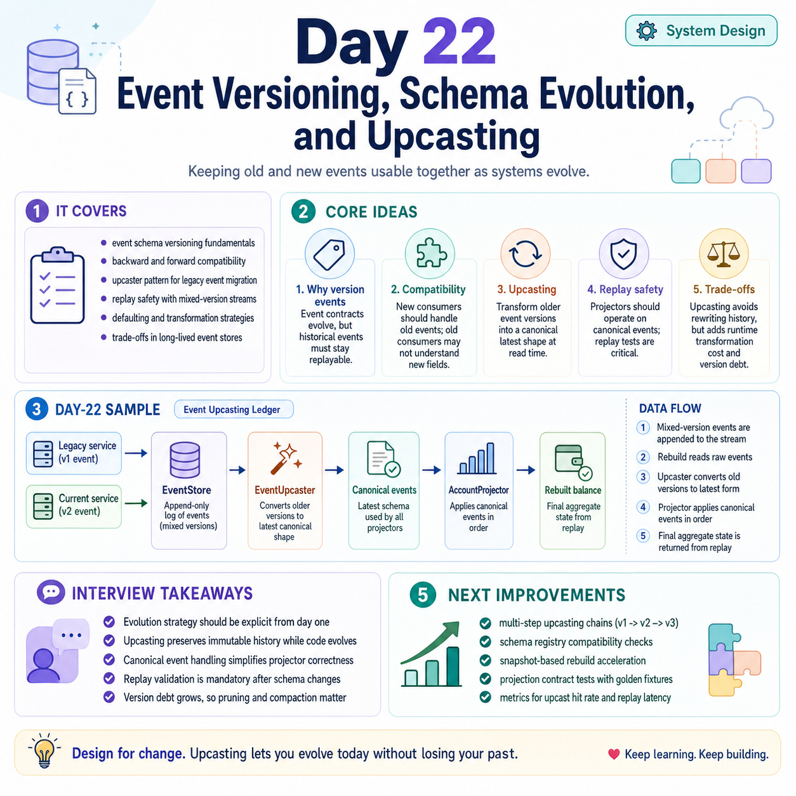

[Day-22 PDF](./Day-22/System_Design_Day_22.pdf)

## Day 23

Schema registry, compatibility checks, and contract safety fundamentals for resilient event-driven systems.

- Topics: versioned message contracts, backward compatibility rules, publish-time validation, producer/consumer evolution
- Focus: how to evolve message schemas safely without breaking independent services
- Sample project: schema registry compatibility simulator in Python and Java

[Read Day-23 notes](./Day-23/README.md)

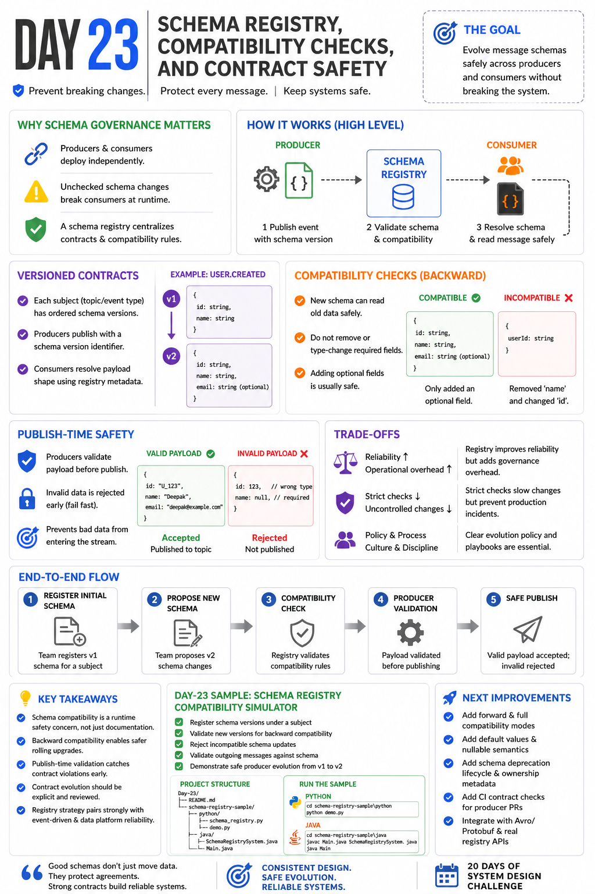

[Day-23 PDF](./Day-23/System_Design_Day_23.pdf)

## Day 24

Idempotent consumer, deduplication, and delivery guarantee fundamentals for reliable event processing.

- Topics: at-least-once delivery, dedup keys, replay safety, duplicate side-effect prevention, processing metrics
- Focus: how to make message processing safe under retries and redelivery without double-applying business effects
- Sample project: idempotent payment consumer simulation in Python and Java

[Read Day-24 notes](./Day-24/README.md)

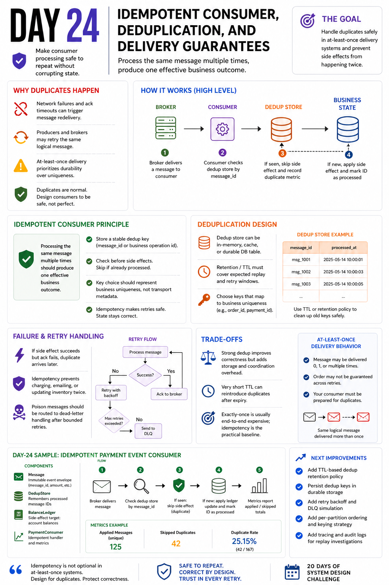

[Day-24 PDF](./Day-24/System_Design_Day_24.pdf)

## Day 25

Inbox pattern, exactly-once effect, and consumer reliability fundamentals for duplicate-safe event processing.

- Topics: durable dedup store, at-least-once delivery, retry safety, transactional processing boundary, duplicate metrics
- Focus: how to ensure each logical message causes one business effect even under repeated delivery
- Sample project: durable inbox payment consumer simulation in Python and Java

[Read Day-25 notes](./Day-25/README.md)

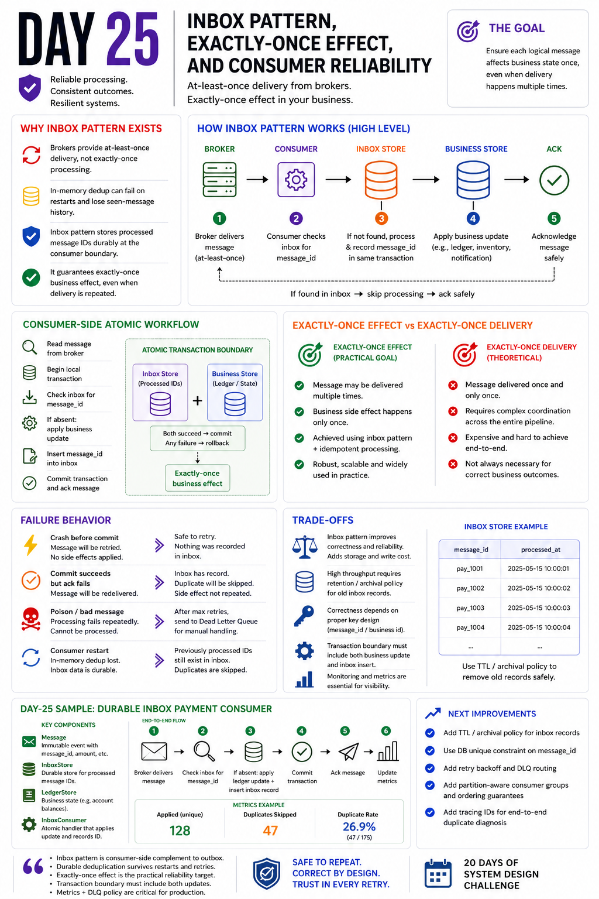

[Day-25 PDF](./Day-25/System_Design_Day_25.pdf)

## Day 26

Retry backoff, dead letter queue, and poison message handling fundamentals for resilient asynchronous processing.

- Topics: bounded retries, backoff policy, max-attempt cutoff, DLQ routing, retry observability
- Focus: how to recover transient failures while isolating permanently failing messages
- Sample project: retry + DLQ simulation in Python and Java

[Read Day-26 notes](./Day-26/README.md)

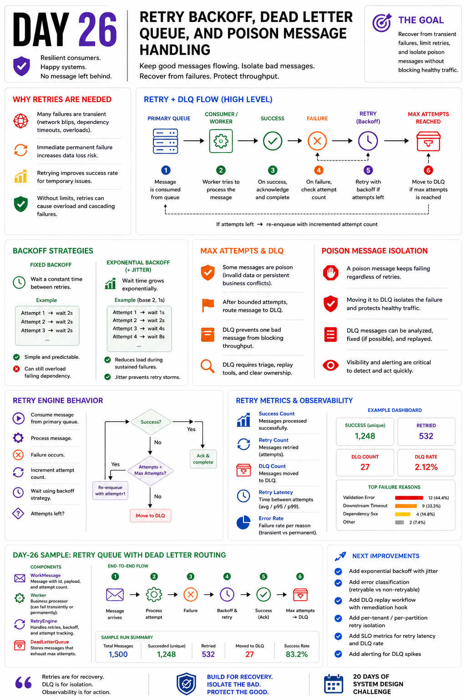

[Day-26 PDF](./Day-26/System_Design_Day_26.pdf)

## Day 27

Backpressure, flow control, and load shedding fundamentals for overload-safe distributed systems.

- Topics: bounded queues, lag signals, watermark admission control, throttling, load shedding, stability trade-offs
- Focus: how to keep services responsive and stable when incoming traffic exceeds processing capacity
- Sample project: backpressure admission controller simulation in Python and Java

[Read Day-27 notes](./Day-27/README.md)

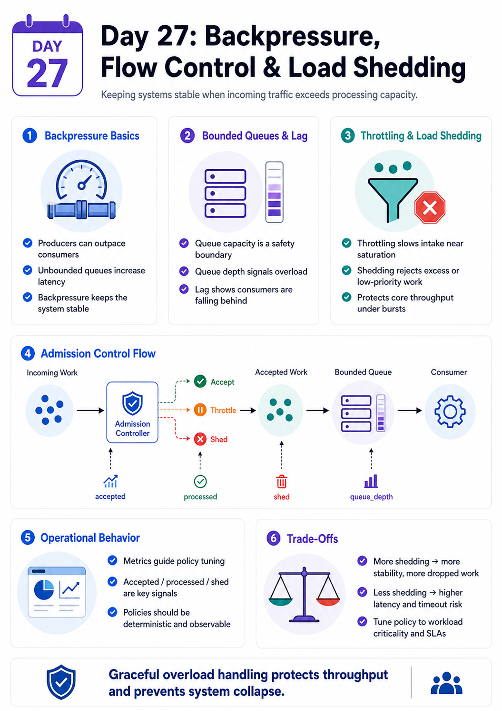

[Day-27 PDF](./Day-27/System_Design_Day_27.pdf)

## Day 28

Bulkhead isolation, worker pools, and blast-radius control fundamentals for overload-safe distributed services.

- Topics: resource isolation, per-lane queues, lane saturation metrics, graceful degradation, capacity partitioning
- Focus: how to keep critical traffic healthy when one workload class or dependency is overloaded
- Sample project: bulkhead worker pool simulator in Python and Java

[Read Day-28 notes](./Day-28/README.md)

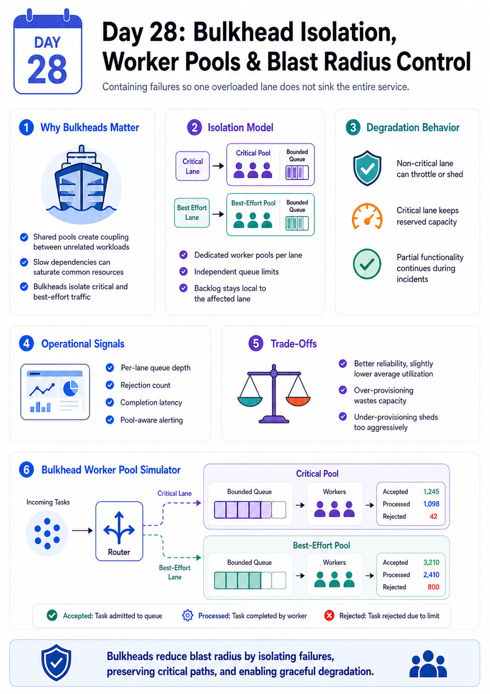

[Day-28 PDF](./Day-28/System_Design_Day_28.pdf)

## Day 29

Circuit breaker, failure thresholds, and recovery probing fundamentals for dependency-failure resilience.

- Topics: closed/open/half-open states, failure thresholds, cooldown windows, probe requests, fail-fast fallback
- Focus: how to prevent repeated downstream failures from cascading into wider service instability
- Sample project: circuit breaker dependency guard simulation in Python and Java

[Read Day-29 notes](./Day-29/README.md)

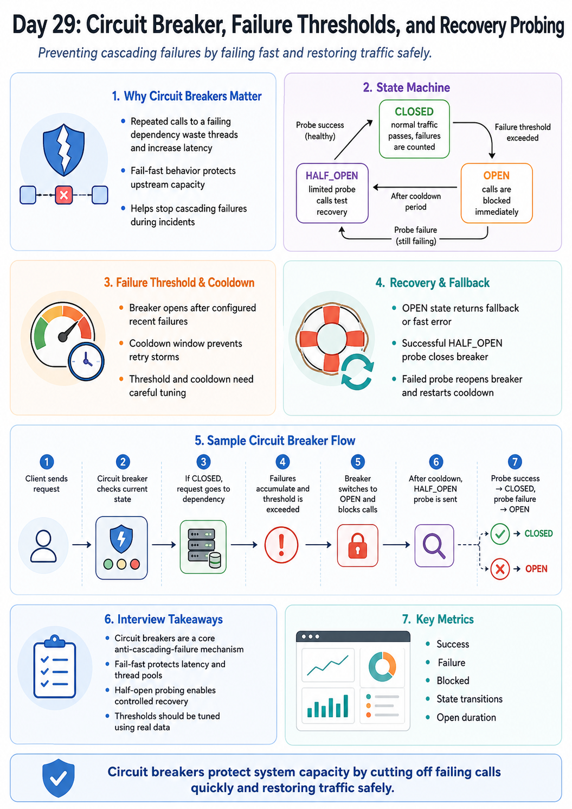

[Day-29 PDF](./Day-29/System_Design_Day_29.pdf)

## Day 30

Timeouts, deadlines, and cancellation propagation fundamentals for latency-bounded distributed request paths.

- Topics: per-hop timeout budgeting, deadline propagation, cancellation semantics, fail-fast behavior, latency trade-offs
- Focus: how to bound tail latency and prevent wasted downstream work when dependencies are slow
- Sample project: deadline guarded request chain simulation in Python and Java

[Read Day-30 notes](./Day-30/README.md)
